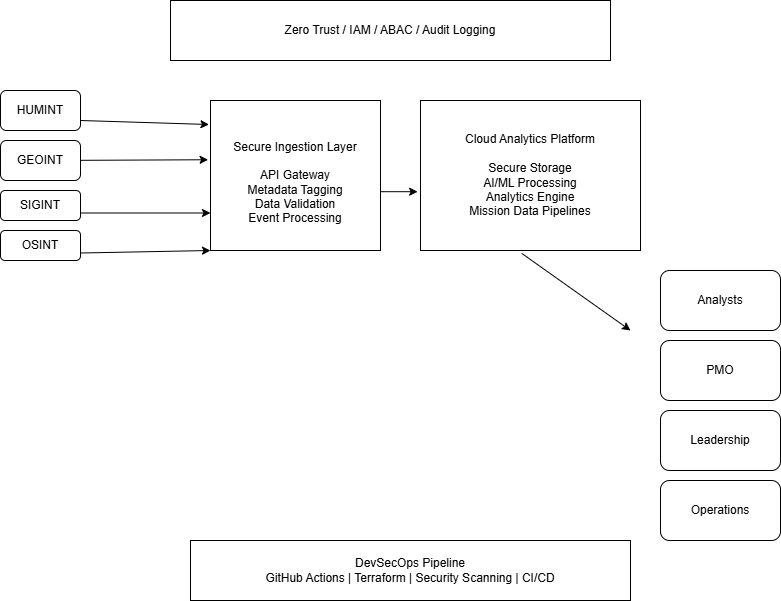

# Secure Mission Modernization Platform

## Overview

This repository demonstrates a secure cloud modernization reference architecture aligned to mission-oriented environments supporting AI-enabled analytics, DevSecOps workflows, and Zero Trust principles.

The platform is designed to illustrate how classified or highly regulated organizations can modernize mission systems using secure cloud infrastructure, enterprise integration patterns, and governance-aligned AI workflows.

This project focuses on:
- Secure cloud modernization
- Mission-system integration
- AI-enabled analytics workflows
- Zero Trust / ABAC access concepts
- DevSecOps coordination
- Secure data pipelines
- Terraform-based infrastructure concepts
- AI governance and auditability

---

## Reference Architecture



---

## Key Components

### Mission Data Sources
- HUMINT
- GEOINT
- SIGINT
- OSINT

### Secure Ingestion Layer
- API Gateway
- Data Validation
- Metadata Tagging
- Event Processing

### Cloud Analytics Platform
- Secure Storage
- AI/ML Processing
- Analytics Workflows
- Data Pipeline Orchestration

### Security & Governance
- IAM
- Zero Trust / ABAC
- Audit Logging
- AI Governance Controls
- Model Oversight

### DevSecOps Workflow
- GitHub Actions
- Terraform Validation
- Security Scanning
- CI/CD Deployment Coordination

## AWS Services Referenced

- Amazon S3
- AWS Lambda
- Amazon API Gateway
- AWS IAM
- Amazon CloudWatch
- AWS CloudTrail
- Amazon SageMaker (conceptual AI workflow alignment)

---

## Operational Considerations

Monitoring and auditability are critical in mission-oriented environments. This architecture incorporates centralized logging, governance checkpoints, and infrastructure validation concepts to support operational resilience, traceability, and secure modernization.

Key operational considerations include:

- Centralized logging for auditability and troubleshooting
- Access governance using IAM and ABAC concepts
- Infrastructure validation through Terraform and CI/CD checks
- Monitoring of pipeline activity and system events
- Clear separation between ingestion, processing, storage, and governance layers

## Repository Structure

```text
terraform/
docs/
diagrams/
```

---

## AI Governance Considerations

This project incorporates AI governance concepts aligned with:
- NIST AI RMF
- Responsible AI practices
- Human oversight
- Auditability
- Explainability
- Access governance
- Secure deployment considerations

---

## Disclaimer

This repository is intended for educational and portfolio demonstration purposes only and does not represent operational government systems or classified implementations.
